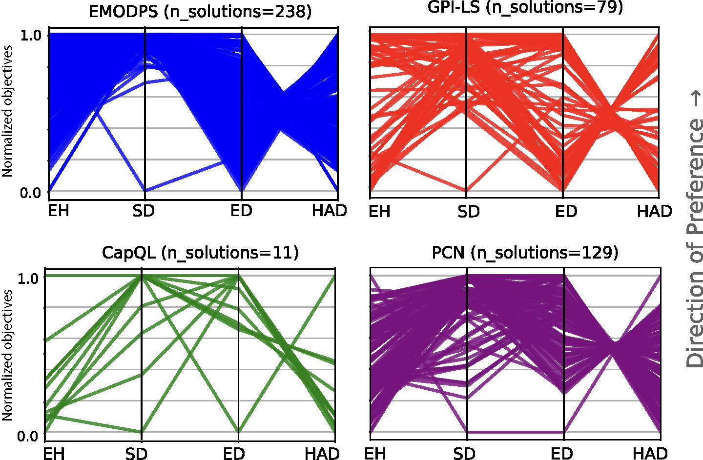

# Multi-Objective Reinforcement Learning for Water Resource Management
Official code repository for ["New Frontiers in Multi-Objective RL: Water Resource Management (AAMAS-2025)](https://ebooks.iospress.nl/doi/10.3233/FAIA240830).  


*Many real-world problems (e.g., water resource management, autonomous driving, drug discovery) require optimizing multiple, conflicting objectives. Multi-objective reinforcement learning (MORL) extends classical RL to handle several objectives simultaneously, yielding a set of policies that capture various trade-offs. However, the field still lacks complex, realistic environments and benchmarks. We introduce two water resource management case studies—the Nile and Susquehanna river basins—and model them as MORL environments. We then benchmark existing MORL algorithms on these tasks. Our results show that specialized water management methods outperform state-of-the-art MORL approaches, underscoring the scalability challenges these algorithms face in real-world scenarios.* 

 

We consider three state-of-the-art MORL algorithms: PCN, CapQL and GPI-LS and one domain-specific algorithm, EMODPS. 

# Description of two, novel, real-worl MORL environments

### Nile 
The Nile River is a critical resource in northeastern Africa, serving as a water source for hydropower, agriculture, and domestic use across multiple nations. Water rights issues, particularly between Egypt, Sudan, and Ethiopia, have intensified with Ethiopia's construction of the Grand Ethiopian Renaissance Dam (GERD), intended for hydropower generation to boost its economic development.

Originally, the simulation starts at **(2025, 1, 1)** and the decisions are taken on a monthly basis over a 20-year period, resulting in **240 time steps** for each episode. It also has 4 following objectives:

1. <span style="color:blue"> Ethiopia power (max), ref point: 0.0<span style="color:blue">
2. <span style="color:blue"> Sudan deficit (min), ref point: -240 <span style="color:blue">
3. <span style="color:blue"> Egypt deficit (min), ref point: -240 <span style="color:blue">
4. <span style="color:blue"> HAD minimum level (max), ref point 0.0 <span style="color:blue">

Where max/main signifies whether an objective is to be maximised or minimised. The reference point is used for calculating hypervolume as the worst case scenario in terms of acquired rewards by the agent at the end of the simulation.

Currently the user may pick their own number of objectives they want to use in their simulations with:

- 2 objectives: Ethiopia power (max) and Egypt deficit (min)
- 3 objectives: Ethiopia power (max), Egypt deficit (min), and Sudan deficit (min)
- 4 objectives: All original objectives

Where in all cases:
- Observation space: Storage in 4 reservoirs, month (5 dimensions)
- Action space: Release per each reservoir (4 dimensions)


Taken from: _Sari, Y. (2022). Exploring Trade-offs in Reservoir Operations through Many-Objective Optimization: Case of the Nile River Basin (Master’s thesis). Delft University of Technology._

### Susquehanna

The Susquehanna River, regulated by the Conowingo Dam, supports diverse needs, including hydroelectric power, water supply, and recreation. However, low-flow conditions create challenging trade-offs, forcing Conowingo to balance energy production with environmental and community water needs.

Originally, the simulation starts at **(2021, 1, 1)** and the decisions are made every 4 hours throughout a year resulting in **2190 time steps** per episode (the whole simulation). It also has 6 following objectives:


1. <span style="color:blue"> Recreation (max), ref point: 0.0<span style="color:blue">
2. <span style="color:blue"> Energy revenue (max), ref point: 0.0 <span style="color:blue">
3. <span style="color:blue"> Baltimore (max), ref point: 0.0  <span style="color:blue">
4. <span style="color:blue"> Atomic (max), ref point: 0.0 <span style="color:blue">
5. <span style="color:blue"> Chester (max), ref point: 0.0 <span style="color:blue">
6. <span style="color:blue"> Environment (min), ref point: -2190 <span style="color:blue">

Where max/main signifies whether an objective is to be maximised or minimised. The reference point is used for calculating hypervolume as the worst case scenario in terms of acquired rewards by the agent at the end of the simulation.

Currently the user may pick their own number of objectives they want to use in their simulations with:

  - 2 objectives: Baltimore (max) vs Chester (max)
  - 3 objectives: Baltimore (max), Atomic (max), Chester (max)
  - 4 objectives: Baltimore (max), Atomic (max), Chester (max), Recreation (max)
  - 5 objectives: Baltimore (max), Atomic (max), Chester (max), Recreation (max), revenue (max)
  - 6 objectives: Baltimore (max), Atomic (max), Chester (max), Recreation (max), revenue (max), environmental index (min)


Where in all cases:
- Observation space: Water level, month (2 dimensions)
- Action space: Release per each reservoir (4 dimensions)

Taken from: _Muniak, K. (2024). RL4Water: Reinforcement Learning Environment for Water Management (Bachelor’s thesis). Delft University of Technology, Faculty of EEMCS._

## MOMDP

Both environment are structured in the same manner. 

### States

The state is represented as the status of each reservoir in the system and a normalized timestamp. It is structured as a tuple, where the dimension of the tuple corresponds to the number of reservoirs plus one. Each component of the tuple takes a continuous value between `[0, 1]`, representing the percentage of the reservoir's storage relative to its maximum capacity. The normalized timestamp (also taking values between `[0, 1]`) is included to capture temporal information, such as the month, hour, or day of the year. This enables the system to account for seasonal and diurnal variations.

- **Nile**: The state is a 5-dimensional vector, with the components representing the storage of the four reservoirs modeled and the normalized month of the year.
- **Susquehanna**: The state is a 2-dimensional vector. The first dimension represents the relative water level in the Conowingo Dam, expressed as a percentage of the maximum water level in the reservoir. The second dimension corresponds to the normalized hour of the day. This state representation is taken from the original simulation by Giuliani et al. (2014).

### Actions

Actions are represented as tuples, where the dimension of the tuple refers to the number of reservoirs integrated into the Water Management System (WMS) or the number of outflows from each reservoir. Each component of the action tuple is represented as a percentage of water to be released, constrained by the maximum release limit, and is a continuous value within the range `[0, 1]`.

- **Nile**: The action tuple is four-dimensional, where each dimension represents the percentage of water to be released from one of the following dams: GERD, Roseires, Sennar, and HAD.
- **Susquehanna**: The release decisions at the Conowingo Dam are divided into four directions: Baltimore, Chester, the atomic plant, and downstream (for hydroelectricity and further flow of the Susquehanna). Thus, the action tuple for the Susquehanna environment is four-dimensional, where each dimension corresponds to the percentage of water released to each destination.

### Rewards (Objectives)

The environment returns a reward vector, whose dimension is determined by the number of objectives. Rewards can be defined for each component of the Water Management System (WMS). For instance, if the goal is to maximize hydropower production, the objective can be specified in the `PowerPlant` class. The toolkit offers different reward functions depending on the goal: in some cases, maximizing production is the priority, while in others, ensuring a minimum level of power generation is more critical.

Additionally, in Multi-Objective Reinforcement Learning (MORL), all objectives must be framed as maximization problems. Objectives that need to be minimized are converted by transforming their rewards to negative values, effectively reframing them as maximization tasks.

- **Nile**: The reward is four-dimensional (refer to Table X for details).
- **Susquehanna**: The reward is six-dimensional (refer to Table Y for details).

Since the objective values may be on different scales (e.g., demand deficit vs. number of months), they are normalized to the range `[-1, 1]`.


# Running

### Running the environments
To run an episode with random actions, run `nile_example.py` or `susquehanna_example.py`.

### Training MORL agents
To train MORL agents, run `train_morl.py` [[morl-baselines](https://github.com/LucasAlegre/morl-baselines)]:
 - to train Nile, run:
 ```bash
 python train_morl.py --algo pcn --gamma 1.0 --env-id nile-v0 --num-timesteps 2000000 --ref-point 0 -240 -240 0 --seed 2 --init-hyperparams learning_rate:0.0003 hidden_dim:64 
 ```

 - to train Susquehanna, run:
 ```bash
 python train_morl.py --algo gpi_ls_continuous --gamma 1.0 --env-id susquehanna-v0 --num-timesteps 200000 --ref-point 0 0 0 0 0 -2190 --init-hyperparams learning_rate:0.0004 buffer_size:1500000 learning_starts:100 "net_arch:[64,64]" per:True --seed 2137
```

### Training EMODPS

To train EMODPS agent, run `train_emodps.py`

 - to train Nile, run:
 ```bash
 python python run_experiment.py --water-sim nile --num-of-obj 4 --nfes 200000 --seed 1 --epsilons 5e-01 5e-01 5e-01 5e-01 --ref-point 0 -240 -240 0
 ```

 - to train Susquehanna, run:
 ```bash
python run_experiment.py --water-sim susquehanna --num-of-obj 6 --nfes 20000 --seed 1 --epsilons 5e-01 5e-01 5e-01 5e-01 5e-01 5e-01 --ref-point 0 0 0 0 0 -2190
```

## Organization

- folder **core** consists of core code to build the water environments
- folder **examples** consists of high-level code od the environments
- folder **rbf** consists of functions to be used for EMODPS


## Installation  
  
The project is based on Python >=3.10. All the necessary packages are in requirements.txt.
Create a virtual environment and install the requirements using:
```
pip install -r requirements.txt
```

## Requierements

### Required repositories
To train the MORL agents, MORL Baselines implementations of MORL algoeithms were used.

[https://github.com/LucasAlegre/morl-baselines](https://github.com/LucasAlegre/morl-baselines)


